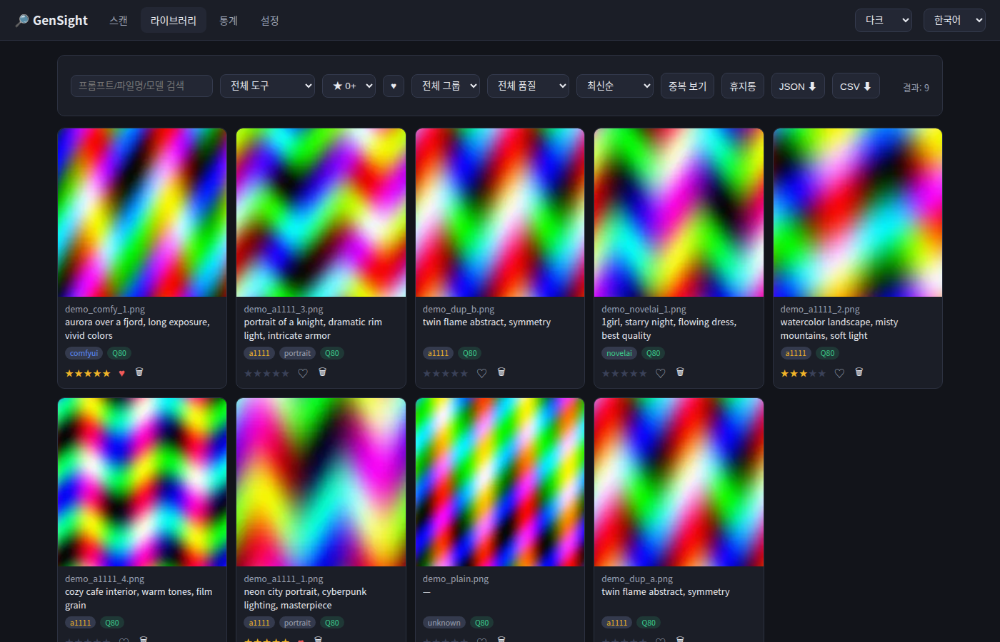
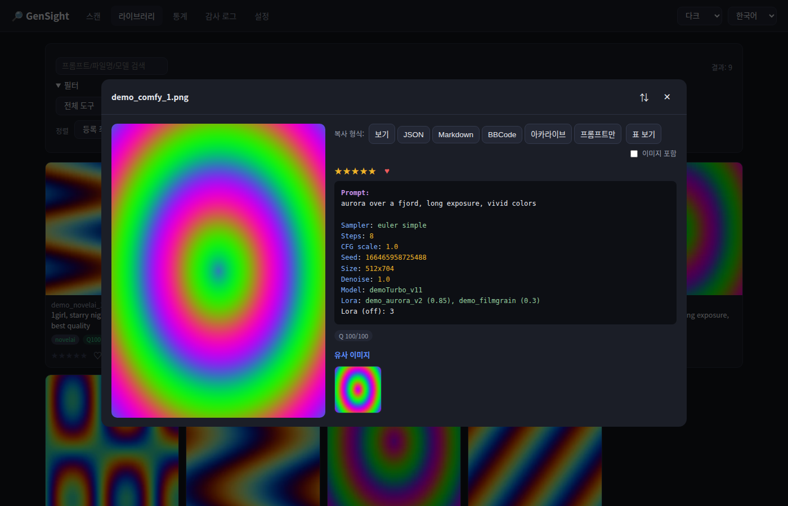
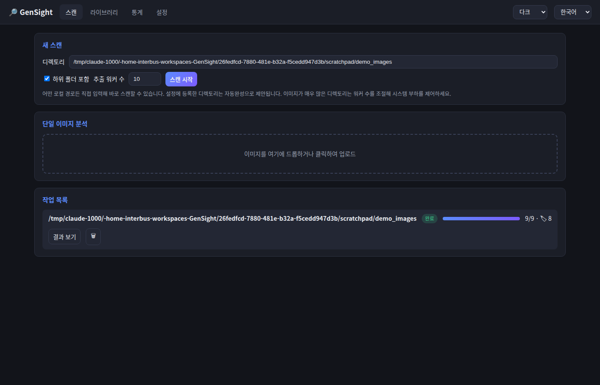
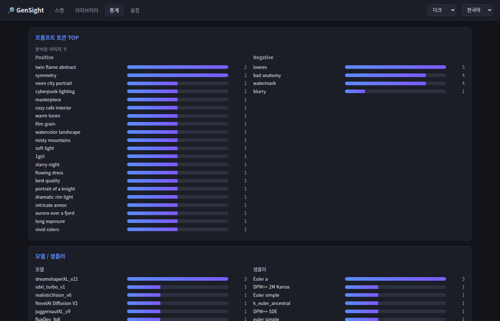
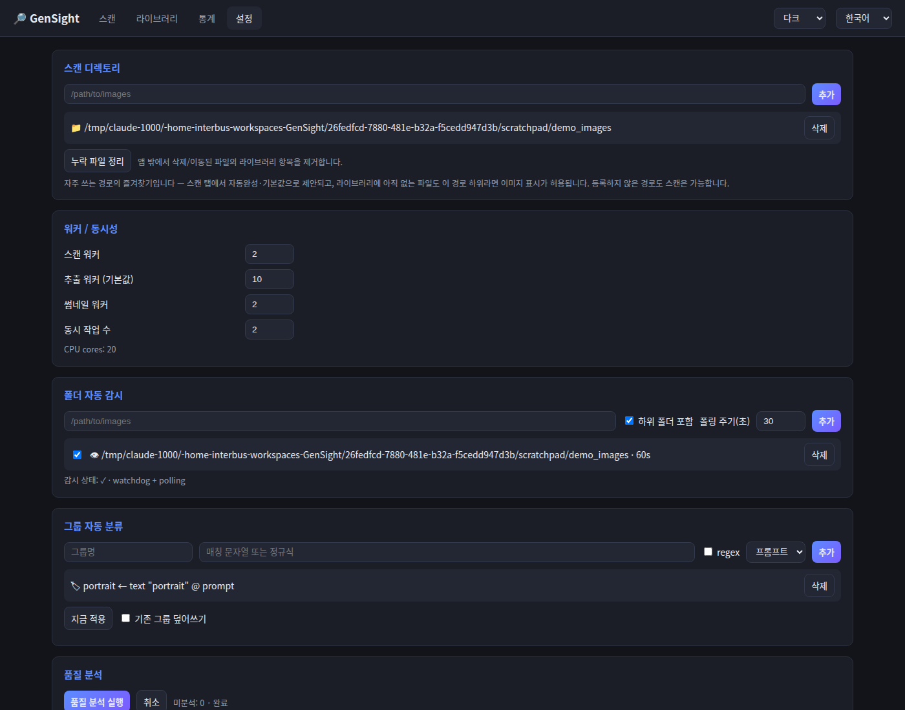

# GenSight

AI 생성 이미지 메타데이터 추출 WebUI — AI-generated image metadata extractor web UI.

지정한 디렉토리의 AI 생성 이미지(Stable Diffusion / ComfyUI / NovelAI 등)를 스캔해
프롬프트·네거티브 프롬프트·샘플러·CFG·시드·모델 등의 생성 설정을 추출하고,
게시판에 붙여넣기 좋은 형식(JSON / Markdown / BBCode)으로 복사할 수 있는 로컬 도구입니다.

## Features

- **메타데이터 추출**: A1111/Forge/SD.Next(`parameters`), ComfyUI(워크플로 그래프 파싱), NovelAI, JPEG/WebP EXIF
- **영구 라이브러리 (SQLite)**: 스캔 결과가 `data/gensight.db`에 저장되어 재시작 후에도 유지, 증분 재스캔
- **폴더 자동 감시**: watchdog 실시간 감지 + 주기적 폴링 폴백, 감시 폴더별 주기 설정
- **유사/중복 검색**: perceptual hash(dHash) 기반 — 중복 그룹 보기, 상세에서 유사 이미지 스트립
- **프롬프트 통계**: Positive/Negative 토큰 빈도, 모델/샘플러 사용 통계 대시보드
- **평점·즐겨찾기·그룹**: ★1–5 평점, ♥ 즐겨찾기, 문자열/정규식 규칙 기반 그룹 자동 분류
- **WD Tagger 자동 태깅** (선택 설치): onnxruntime 기반, 설정된 멀티 GPU에 작업 분배
- **MCP 서버**: Claude Code 등 AI 클라이언트에서 라이브러리 검색/통계 조회 ([docs/mcp.md](docs/mcp.md))
- **대량 이미지 대응**: 작업(스캔)별 워커 수 조정, 동시 작업 수 제한, 백그라운드 작업 큐 + 진행률/취소
- **단일 이미지 분석**: 드래그 & 드롭 / 클릭 업로드로 즉시 분석
- **게시판용 복사**: JSON / Markdown / BBCode / 프롬프트만 — 썸네일 이미지 포함 복사 지원
- **내보내기**: 스캔 결과 전체를 JSON / CSV로 다운로드
- **다국어**: 한국어 / English / 日本語 (웹 UI에서 즉시 전환)

## Quick start (venv)

```bash
./run.sh start     # 백그라운드 시작 (./run.sh 만 치면 포그라운드 실행)
```

첫 실행 시 `.venv` 생성과 의존성 설치가 자동으로 이루어집니다.
브라우저에서 <http://127.0.0.1:8090> 을 엽니다.

```bash
./run.sh status    # 상태 + 헬스체크
./run.sh restart   # 재시작 (reload 동일 — uvicorn은 핫 리로드 시그널 미지원)
./run.sh stop      # 종료
```

PID/로그는 `data/gensight.pid`, `data/gensight.log`에 기록됩니다.

수동 설치:

```bash
python3 -m venv .venv
source .venv/bin/activate
pip install -r requirements.txt
uvicorn app.main:app --port 8090
```

## Docker

```bash
docker compose up --build
```

이미지 디렉토리는 `docker-compose.yml`의 volumes에 read-only로 마운트한 뒤,
웹 UI 설정에서 컨테이너 내부 경로(`/images/...`)를 등록하세요.

## Screenshots

### 라이브러리 — 검색·필터·평점·품질 배지


### 상세 보기 — syntax 하이라이트, 게시판용 복사(JSON/Markdown/BBCode/표)


### 스캔 · 통계 · 설정
| 스캔 | 통계 |
|---|---|
|  |  |



## Documentation

- [설치 및 업그레이드](docs/installation.md)
- [사용자 가이드](docs/user-guide.md)
- [유지보수 가이드](docs/maintenance.md)
- [API 레퍼런스](docs/api.md)

## Usage

1. **설정** 탭에서 이미지 디렉토리를 추가합니다.
2. **스캔** 탭에서 디렉토리를 선택하고 워커 수를 조정해 스캔을 시작합니다.
3. **결과** 탭에서 이미지를 클릭 → 원하는 형식으로 복사합니다.

출력 예시 (JSON):

```json
{
  "prompt": "A high-resolution photorealistic ...",
  "negative_prompt": "",
  "Sampler": "Euler simple",
  "CFG scale": "1.0",
  "Seed": "166465958725488",
  "Size": "832x1216",
  "Model hash": "5394fca4fa",
  "Model": "krea2TurboOfficialComfy_krea2TurboNvfp4"
}
```

## Project layout

```
app/            FastAPI backend
  main.py       API routes + static serving
  metadata.py   A1111 / ComfyUI / NovelAI / EXIF parsers
  scanner.py    Background scan jobs, worker pools, job queue
  config.py     JSON settings persistence (data/settings.json)
  gpu.py        nvidia-smi based GPU detection
web/            Frontend (vanilla JS, no build step)
  i18n/         ko / en / ja translations
tests/          pytest unit tests
data/           Runtime data: settings, thumbnail cache (gitignored)
```

## Settings

모든 설정은 웹 UI **설정** 탭에서 관리되며 `data/settings.json`에 저장됩니다.

| 항목 | 설명 |
|---|---|
| 스캔 디렉토리 | 스캔 대상 경로 목록 (이미지 서빙도 이 경로 하위로 제한) |
| 추출 워커 | 메타데이터 추출 스레드 수 (작업별로 재정의 가능) |
| 동시 작업 수 | 동시에 실행되는 스캔 작업 수 |
| GPU | ML 분석에 사용할 GPU 선택, GPU당 동시 작업 수 |

## Roadmap

- [x] 결과 영구 저장 (SQLite) 및 증분 스캔
- [x] 폴더 자동 감시 (watchdog + 폴링 폴백)
- [x] 중복 이미지 탐지 (perceptual hash)
- [x] 프롬프트 통계 대시보드 (자주 쓴 토큰 / 모델 / 샘플러)
- [x] 평점 / 즐겨찾기 / 그룹 자동 분류
- [x] WD Tagger 태깅 (멀티 GPU 분산, 선택 설치)
- [x] MCP 서버 (Claude Code 연동)
- [x] 품질 판별: 휴리스틱(블러/노출/대비/해상도) + 생성 설정 검사
- [x] 휴지통(복구 지원) / 템플릿 기반 파일 정리
- [x] 사용자 인증 (scrypt + 세션, 선택 활성화)
- [ ] 신체 파손(anatomy) 검출 — ML detector 플러그인 ([docs/architecture.md](docs/architecture.md) 참조)
- [ ] 프론트엔드 ESM 모듈 분리 → (필요 시) Vue 3 + Vite

## Tests

```bash
.venv/bin/python -m pytest tests/ -v
```

## License

MIT
