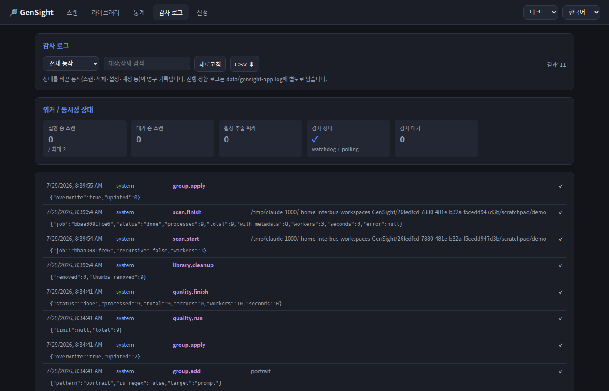

# GenSight

AI 생성 이미지 메타데이터 추출 WebUI — AI-generated image metadata extractor web UI.

지정한 디렉토리의 AI 생성 이미지(Stable Diffusion / ComfyUI / NovelAI 등)를 스캔해
프롬프트·네거티브 프롬프트·샘플러·CFG·시드·모델 등의 생성 설정을 추출하고,
게시판에 붙여넣기 좋은 형식(JSON / Markdown / BBCode)으로 복사할 수 있는 로컬 도구입니다.

## Features

- **메타데이터 추출**: A1111/Forge/SD.Next(`parameters`), ComfyUI(워크플로 그래프 파싱), NovelAI, JPEG/WebP EXIF
- **적용된 LoRA 추출**: A1111 인라인 `<lora:…>` 태그와 ComfyUI 로더(LoraManager / rgthree
  Power Lora Loader / easy loraStack). **활성 플래그로 판정**하므로 꺼둔 LoRA는 제외되고,
  꺼진 개수는 `Lora (off)`로 따로 표시합니다
- **영구 라이브러리 (SQLite)**: 스캔 결과가 `data/gensight.db`에 저장되어 재시작 후에도 유지, 증분 재스캔
- **폴더 자동 감시**: watchdog 실시간 감지 + 주기적 폴링 폴백, 감시 폴더별 주기 설정
- **유사/중복 검색**: perceptual hash(dHash) 기반 — 중복 그룹 보기, 상세에서 유사 이미지 스트립
- **프롬프트 통계**: Positive/Negative 토큰 빈도, 모델/샘플러 사용 통계 대시보드
- **평점·즐겨찾기·그룹**: ★1–5 평점, ♥ 즐겨찾기, 문자열/정규식 규칙 기반 그룹 자동 분류
- **품질 판별**: 블러/노출/대비/해상도 휴리스틱 + 생성 설정 검사(낮은 Steps, 극단적 CFG) → 0–100 점수
- **콘텐츠 등급 (후방주의)**: PG / PG-13 / R / X 분류, R·X 썸네일 블러 처리 및 등급 필터
- **정렬·페이지네이션**: 1·2·3순위 다중 정렬(등록일 / 파일 날짜 / 평점 / 품질 / 이름 / 용량), 페이지 단위 조회
- **WD Tagger 자동 태깅** (선택 설치): onnxruntime 기반, 설정된 멀티 GPU에 작업 분배
- **기록 정리 + 아카이브**: 경로 단위로 라이브러리 기록만 정리 — 파일은 건드리지 않고,
  미리보기로 확인한 뒤 아카이브로 옮겨 복구할 수 있습니다. 재스캔 시 태그·품질이 재계산 없이 부활
- **휴지통 / 파일 정리**: 복구 지원 휴지통, 템플릿 기반 파일 이동(`{model}/{date}` 등)
- **인증 + 역할**: 선택 활성화(scrypt + 세션). 일반 사용자 역할은 설정·스캔·경로 정보에
  접근할 수 없어 외부 노출용으로 배포할 수 있습니다
- **감사 로그**: 상태를 바꾼 동작(스캔·삭제·정리·계정·설정)의 영구 기록, CSV 내보내기
- **MCP 서버**: Claude Code 등 AI 클라이언트에서 라이브러리 검색/통계 조회 ([docs/mcp.md](docs/mcp.md))
- **대량 이미지 대응**: 작업(스캔)별 워커 수 조정, 동시 작업 수 제한, 백그라운드 작업 큐 + 진행률/취소
- **단일 이미지 분석**: 드래그 & 드롭 / 클릭 업로드로 즉시 분석
- **게시판용 복사**: 보기 / JSON / Markdown / BBCode / 아카라이브 / 프롬프트만 — 표 형식 보기와
  이미지 포함 복사 지원. 적용된 LoRA와 WD Tagger 태그가 프롬프트 바로 옆 섹션으로
  들어가 그대로 복사됩니다
- **내보내기**: 라이브러리 전체 또는 필터 결과를 JSON / CSV로 다운로드
- **테마 + 모바일**: 다크 / 라이트 / Nord 테마, 폰 화면 대응(560px 이하 전용 레이아웃)
- **다국어**: 한국어 / English / 日本語 (웹 UI에서 즉시 전환)

## Quick start (venv)

```bash
./run.sh start     # 백그라운드 시작 (./run.sh 만 치면 포그라운드 실행)
```

첫 실행 시 `.venv` 생성과 의존성 설치가 자동으로 이루어집니다.
브라우저에서 <http://127.0.0.1:8090> 을 엽니다.

```bash
./run.sh status    # 상태 + 헬스체크
./run.sh restart   # 재시작 (reload 동일 — uvicorn은 핫 리로드 시그널 미지원)
./run.sh stop      # 종료
```

PID/로그는 `data/gensight.pid`, `data/gensight.log`에 기록됩니다.

수동 설치:

```bash
python3 -m venv .venv
source .venv/bin/activate
pip install -r requirements.txt
uvicorn app.main:app --port 8090
```

## Docker

Docker Hub에 이미지가 올라가 있어 빌드 없이 바로 실행할 수 있습니다.

```bash
docker run --rm -p 8090:8090 \
  -v gensight-data:/opt/gensight/data \
  -v /path/to/images:/images:ro \
  jimotmi/imagen-curation:0.1.0
```

| 태그 | 내용 | 압축 크기 |
|---|---|---|
| `0.1.0`, `latest` | CPU 전용 (`python:3.12-slim`) | 74 MB |
| `0.1.0-ml` | WD Tagger 포함 (CPU 추론 가능) | 1.9 GB |
| `0.1.0-cuda13` | CUDA 13 호스트용 GPU 이미지 | 2.3 GB |

소스에서 빌드하려면:

```bash
docker compose up --build                      # CPU
docker compose --profile cuda13 up --build     # GPU (CUDA 13)
docker build --build-arg WITH_ML=true -t gensight:ml .   # 태거 포함 CPU 이미지
```

이미지 디렉토리는 `docker-compose.yml`의 volumes에 read-only로 마운트한 뒤,
웹 UI 설정에서 컨테이너 내부 경로(`/images/...`)를 등록하세요. 라이브러리 DB와
썸네일은 `/opt/gensight/data` 볼륨에 남으므로 컨테이너를 교체해도 유지됩니다.

## Screenshots

### 라이브러리 — 검색·필터·평점·품질 배지


### 상세 보기 — syntax 하이라이트, 게시판용 복사(JSON/Markdown/BBCode/표)


### 스캔 · 통계
| 스캔 | 통계 |
|---|---|
|  |  |

### 설정 — 기록 정리·아카이브, 워커, 감시


### 감사 로그 — 상태를 바꾼 동작의 영구 기록


## Documentation

- [설치 및 업그레이드](docs/installation.md)
- [사용자 가이드](docs/user-guide.md)
- [유지보수 가이드](docs/maintenance.md)
- [API 레퍼런스](docs/api.md)
- [MCP 서버](docs/mcp.md)
- [아키텍처 / 설계 결정](docs/architecture.md)

## Usage

1. **스캔** 탭에 디렉토리 경로를 직접 입력해 바로 스캔합니다. 자주 쓰는 경로는
   **설정** 탭에 등록해 두면 자동완성으로 제안됩니다.
2. **라이브러리** 탭에서 검색·필터·정렬로 찾습니다.
3. 이미지를 클릭 → 원하는 형식으로 복사합니다.

딥링크도 지원합니다 — `#library`, `#stats`, `#settings`, `#audit`,
그리고 `?detail=<파일 경로>`로 상세 팝업을 바로 열 수 있습니다.

출력 예시 (JSON):

```json
{
  "prompt": "A high-resolution photorealistic ...",
  "negative_prompt": "",
  "Sampler": "Euler simple",
  "CFG scale": "1.0",
  "Seed": "166465958725488",
  "Size": "832x1216",
  "Model hash": "5394fca4fa",
  "Model": "krea2TurboOfficialComfy_krea2TurboNvfp4",
  "Lora": "krea2_kgirl_v3 (0.9), krea2filterbypass (1)",
  "Lora (off)": "3"
}
```

## Project layout

```
app/                 FastAPI backend
  main.py            앱 조립: 인증 미들웨어, 예외 핸들러, 라우터 등록, 정적 서빙
  routers/           API 계층 (system / scan / library / media / trash /
                     auth / audit_log / admin_library)
  db.py              SQLite 영속 계층 (WAL, 마이그레이션, 경로 스코프)
  metadata.py        A1111 / ComfyUI / NovelAI / EXIF 파서 + LoRA 추출
  scanner.py         스캔 작업 큐 + 워커 풀
  watcher.py         폴더 감시 (watchdog + 폴링)
  purge.py           경로 단위 기록 정리 → 아카이브
  quality.py         품질 휴리스틱, tagger.py  WD Tagger (선택 ML)
  imghash.py         dHash, stats.py  통계, files.py  휴지통/파일 정리
  auth.py            scrypt + 세션, audit.py  감사 로그
  config.py          settings.json 영속, gpu.py  nvidia-smi GPU 감지
  mcp_server.py      MCP stdio 서버
web/                 프론트엔드 (바닐라 JS, 빌드 단계 없음)
  i18n/              ko / en / ja 번역 (키셋·키 순서 동일, 테스트로 강제)
tests/               pytest (201개)
data/                런타임 데이터: DB, 설정, 썸네일 캐시 (gitignored)
```

## Settings

설정은 웹 UI **설정** 탭에서 관리되며 `data/settings.json`에 저장됩니다.
계정과 라이브러리는 `data/gensight.db`에 있습니다.

| 항목 | 설명 |
|---|---|
| 스캔 디렉토리 | 자주 쓰는 경로 등록 (자동완성 + 이미지 서빙 허용 경로). **등록 해제해도 이미 스캔된 기록은 남습니다** |
| 기록 정리 | 경로 단위로 라이브러리 기록만 정리 — 미리보기 후 아카이브로 이동, 파일은 삭제하지 않음 |
| 아카이브 | 정리된 기록의 보관·복구·보존 기간(기본 30일, `0` = 수동 정리만) |
| 추출 워커 | 메타데이터 추출 스레드 수 (작업별로 재정의 가능) |
| 동시 작업 수 | 동시에 실행되는 스캔 작업 수 |
| 폴더 자동 감시 | 감시 경로별 폴링 주기, 하위 폴더 포함 여부 |
| 그룹 자동 분류 | 문자열/정규식 규칙, 표준 카테고리 프리셋 |
| 품질 분석 | 일괄 실행, 스캔/감시로 추가되는 이미지 자동 분석 |
| WD Tagger | 일괄 실행, 스캔/감시 후 자동 태깅 (배치 1회 — 세션 로드가 비싸 이미지별로 돌리지 않습니다) |
| 파일 정리 | 템플릿 기반 이동 (`{model} {tool} {date} {group} {sampler}`) |
| 인증 / 사용자 관리 | 인증 활성화, 관리자·일반 사용자 계정 |
| GPU | ML 분석에 사용할 GPU 선택, GPU당 동시 작업 수 |

## Roadmap

- [x] 결과 영구 저장 (SQLite) 및 증분 스캔
- [x] 폴더 자동 감시 (watchdog + 폴링 폴백)
- [x] 중복 이미지 탐지 (perceptual hash)
- [x] 프롬프트 통계 대시보드 (자주 쓴 토큰 / 모델 / 샘플러)
- [x] 평점 / 즐겨찾기 / 그룹 자동 분류
- [x] WD Tagger 태깅 (멀티 GPU 분산, 선택 설치)
- [x] MCP 서버 (Claude Code 연동)
- [x] 품질 판별: 휴리스틱(블러/노출/대비/해상도) + 생성 설정 검사
- [x] 휴지통(복구 지원) / 템플릿 기반 파일 정리
- [x] 사용자 인증 (scrypt + 세션, 선택 활성화) + 제한 역할
- [x] 콘텐츠 등급 분류 (PG/PG-13/R/X) + 후방주의 블러
- [x] 감사 로그 + 워커/동시성 상태 대시보드
- [x] 경로 단위 기록 정리 + 아카이브(복구·보존 기간)
- [x] 적용된 LoRA 추출 (A1111 인라인 + ComfyUI 로더 3종)
- [x] 모바일 레이아웃 (560px 이하 전용 breakpoint)
- [ ] 신체 파손(anatomy) 검출 — ML detector 플러그인 ([docs/architecture.md](docs/architecture.md) 참조)
- [ ] LoRA 사용 통계 / LoRA 기준 필터
- [ ] 프론트엔드 ESM 모듈 분리 → (필요 시) Vue 3 + Vite

## Tests

```bash
.venv/bin/python -m pytest tests/ -v
```

브라우저 없이 UI 회귀를 잡는 테스트가 포함되어 있습니다 — 폰 breakpoint의 형태
(`tests/test_mobile_layout.py`)와 i18n 마크업 규칙·3개 언어 키셋 일치
(`tests/test_i18n_markup.py`).

## License

MIT
